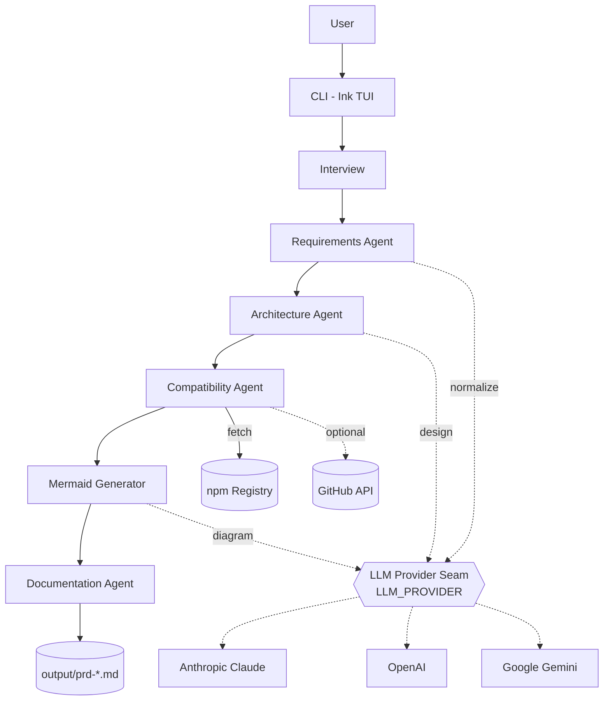

# Architect-AI

> An AI Technical Architect that turns natural-language project ideas into production-grade architecture plans.

Architect-AI is a CLI that conducts a short interview about your project, then generates a Markdown PRD with:

- a recommended technology stack with rationale, tradeoffs, and confidence scores
- Architecture Decision Records (ADRs)
- a Mermaid system diagram
- deterministic compatibility validation against the npm registry
- effort, team size, and infrastructure cost estimates

Switch between **Anthropic Claude**, **OpenAI**, and **Google Gemini** with a single env flag.

---

## Quick start

```bash
pnpm install
cp .env.example .env
# edit .env and set the API key for whichever provider you choose
pnpm dev
```

The interview takes about two minutes. Output is written to `./output/prd-<project-slug>-<timestamp>.md`.

### Requirements

- Node.js 22 or newer
- pnpm (any recent version)
- An API key from at least one of: Anthropic, OpenAI, Google AI Studio

---

## Configuration

All configuration is via environment variables (`.env`).

### Provider switching

```bash
LLM_PROVIDER=anthropic   # anthropic | openai | gemini

ANTHROPIC_API_KEY=...    # required if LLM_PROVIDER=anthropic
OPENAI_API_KEY=...       # required if LLM_PROVIDER=openai
GEMINI_API_KEY=...       # required if LLM_PROVIDER=gemini
```

### Default models per provider

| Provider | Interview step | Architecture / diagram step |
| --- | --- | --- |
| `anthropic` | `claude-haiku-4-5` | `claude-sonnet-4-6` |
| `openai` | `gpt-4o-mini` | `gpt-4o` |
| `gemini` | `gemini-2.5-flash` | `gemini-2.5-pro` |

The interview step is intentionally cheap (it just normalizes structured answers); the architecture step uses the more capable model. Override either:

```bash
LLM_MODEL_INTERVIEW=claude-haiku-4-5
LLM_MODEL_ARCHITECTURE=claude-haiku-4-5   # cheapest possible Anthropic run
LLM_MODEL_DIAGRAM=claude-haiku-4-5
```

### Optional

```bash
GITHUB_TOKEN=...   # raises GitHub rate limits for release lookups; skipped silently if absent
```

---

## Usage

```bash
pnpm dev
```

You'll be asked ~10 short questions: project name, summary, expected scale, deployment preference, auth needs, AI requirements, budget sensitivity, timeline, and architecture mode.

### Architecture modes

The mode biases how the system makes tradeoffs:

| Mode | Bias |
| --- | --- |
| `mvp` | Boring proven tech, shortest path to working product |
| `enterprise` | Compliance, scale, observability, audit trails |
| `cost-optimized` | Free tiers, single-instance services, lowest fixed monthly cost |
| `ai-native` | LLM-first product, vector store, eval framework, streaming UI |
| `rapid-prototype` | Time-to-demo over everything; lock-in is fine |
| `oss-only` | Self-hostable, no proprietary SaaS |

---

## Output

A single Markdown file containing:

1. Project overview
2. Recommended stack table (with maturity, confidence, latest npm version)
3. Per-layer detail (rationale, benefits, tradeoffs)
4. Architecture Decision Records
5. Mermaid system architecture diagram
6. Compatibility validation report (flagged deprecated/stale/prerelease packages)
7. Estimations (MVP duration, team size, monthly infra cost, complexity, scalability)

Open the output in any Markdown viewer with Mermaid support (GitHub preview, VS Code, Obsidian) to render the diagram.

---

## Architecture



Solid arrows show the pipeline data flow; dashed arrows show LLM calls and optional external dependencies. The compatibility step is the only deterministic stage — it never calls an LLM.

```
bin/architect-ai.ts          # CLI entry, renders <App />
src/cli/                     # Ink (React-for-terminal) UI
src/agents/                  # Pipeline stages
  requirements.ts            #   interview question bank
  architecture.ts            #   Claude/OpenAI/Gemini → structured stack
  compatibility.ts           #   deterministic npm + GitHub validation
  documentation.ts           #   markdown assembly (no LLM call)
src/llm/                     # Provider abstraction
  types.ts                   #   LLMProvider interface
  anthropic.ts               #   Anthropic implementation (tool-calling)
  openai.ts                  #   OpenAI implementation (tool-calling)
  gemini.ts                  #   Gemini implementation (responseMimeType + cleanup)
  index.ts                   #   factory, switches on LLM_PROVIDER
src/validation/              # npm registry + GitHub releases clients
src/diagrams/mermaid.ts      # LLM-driven Mermaid generation
src/types/                   # Zod schemas for ProjectProfile, Architecture, ValidationResult
```

The pipeline runs five stages sequentially:

1. **Understanding your project** — normalize raw interview answers into a `ProjectProfile`.
2. **Designing the architecture** — call the configured LLM with a mode-aware prompt; receive a fully structured architecture.
3. **Verifying technology choices** — deterministic checks against `registry.npmjs.org` (deprecation, stale releases, peer-dep conflicts) and optionally GitHub releases. Confidence scores are penalized accordingly.
4. **Visualizing the system** — generate a Mermaid `graph TD`.
5. **Generating your PRD** — assemble the final Markdown document.

---

## Development

```bash
pnpm test                   # run vitest once
pnpm test:watch             # watch mode
pnpm exec tsc --noEmit      # type-check
pnpm build                  # compile to dist/
pnpm start                  # run the compiled JS
```

---

## Scope

### Included (MVP)

- CLI interview engine
- Stack recommendation with rationale
- Compatibility validation
- ADR generation
- Mermaid diagrams
- Markdown export

### Deferred

- Web UI
- MCP server
- DOCX / PDF export
- Persistent sessions
- Repo scaffolding
- Collaborative editing

---

## License

MIT.